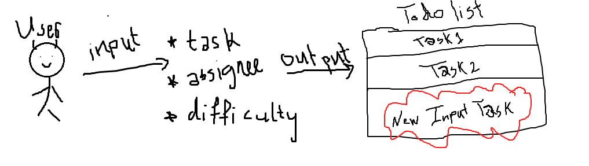

# LAB - Class 32

### Author: Muhammed Tommalieh

### Links and Resources

- [submission PR](https://github.com/401-advanced-javascript-tommalieh/todo/pull/2)

#### How to initialize/run your application

- e.g. `npm start`

#### UML

